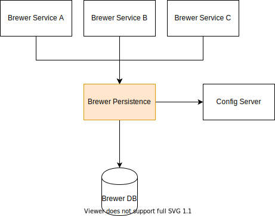

# Brewer Persistence

A containerized micro service which exposes a Rest API for the _Brewer_ database.

[TODO]

## Employed Technology

||||||
|:---:|:---:|:---:|:---:|:---:|
- Java 11
- Spring Boot 2
- Spring Cloud Config
- Spring Cloud Circuit Breaker
  - Resilience4j
- Spring Data JPA
  - Hibernate
- Flyway
- Docker
- Gradle
